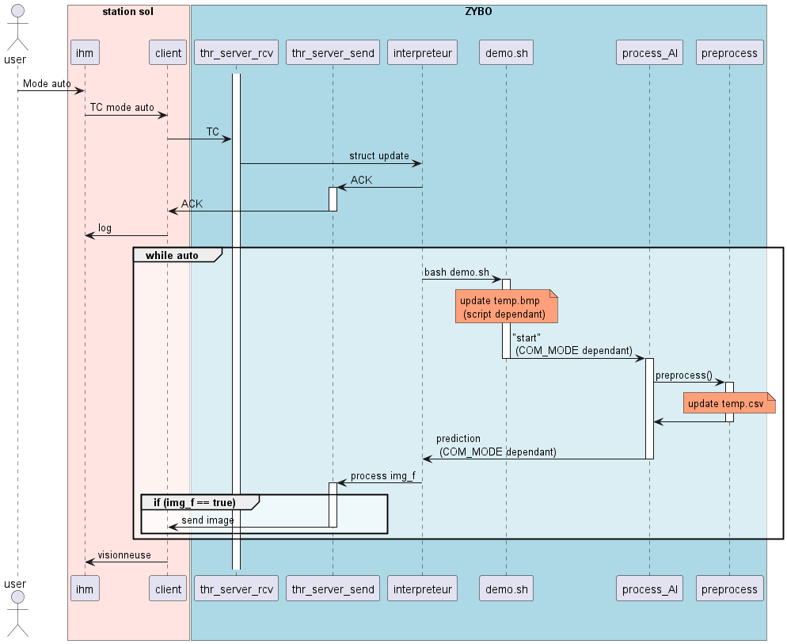
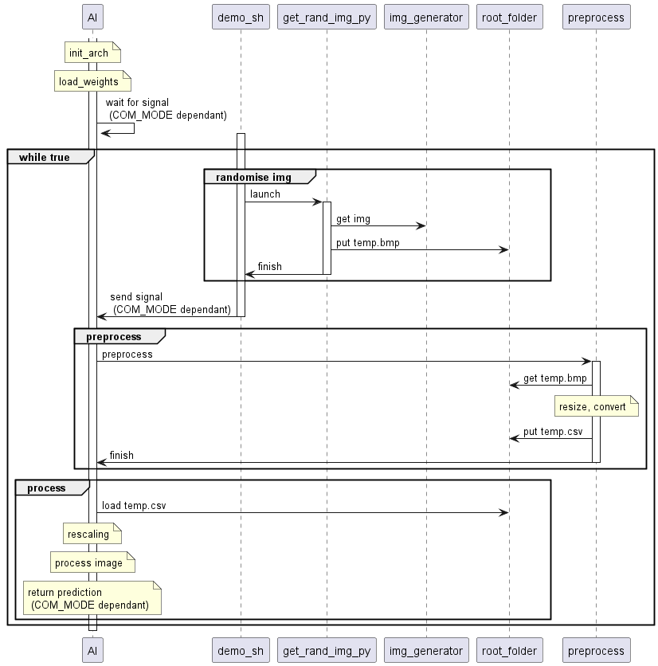
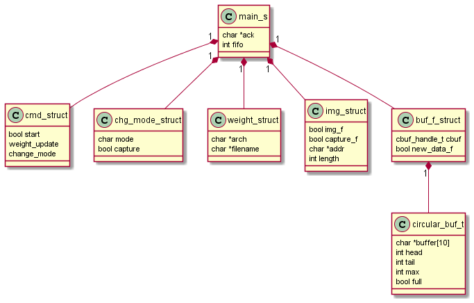
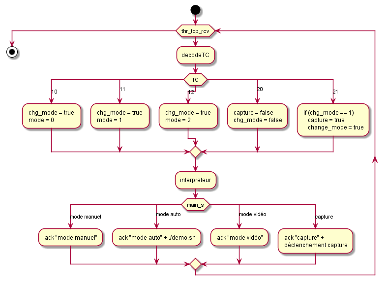
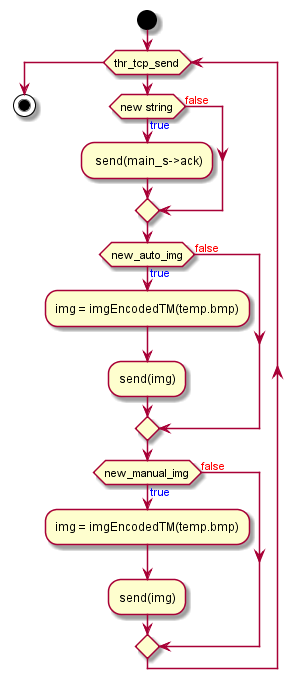
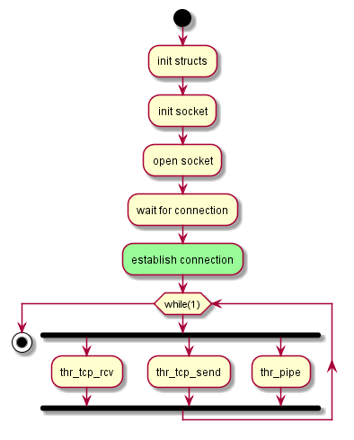
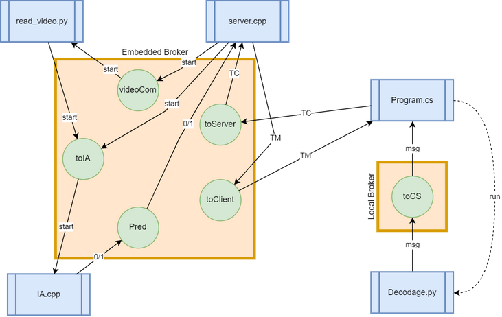
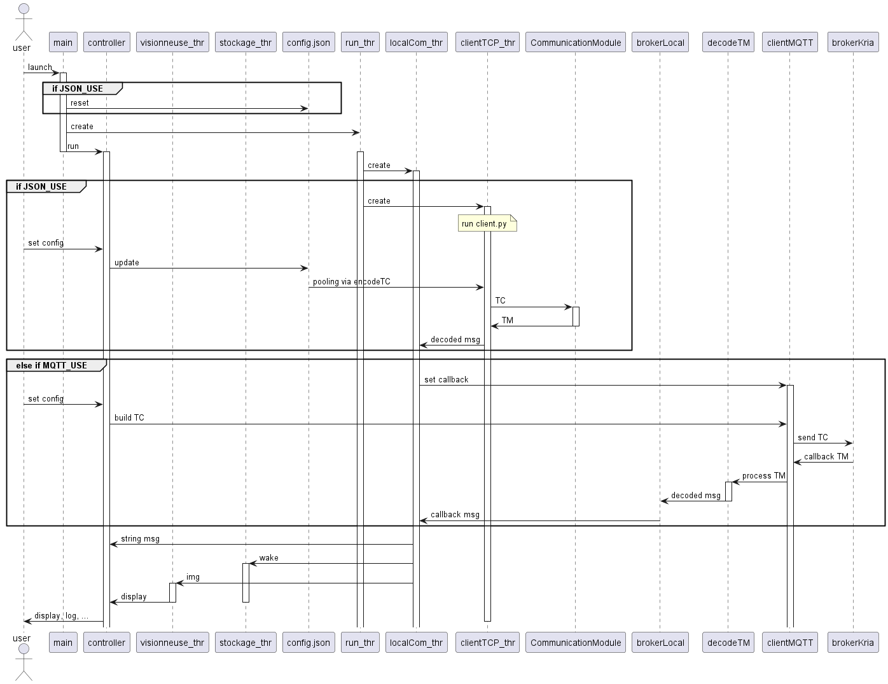

# A-Eye_Documentation
Documentation for A-Eye project    
This folder is there to create UML documentation using plantUML.  

## A-Eye_Visor
### Auto mode
  
### Focus on AI 

## A-Eye_Communication
### Structures diagram

### Thread receive
  
### Thread send

### TCP server

### MQTT architecture  
  

## A-Eye_Controller

