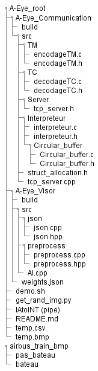
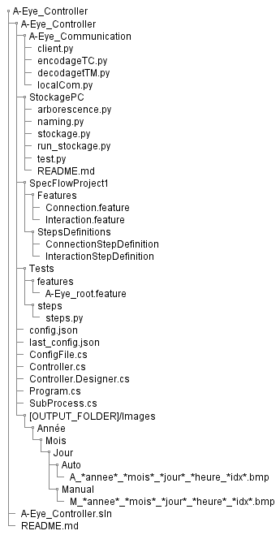

# A-Eye_Documentation
Documentation du projet A-Eye  
Ce projet permet notamment de collaborer sur les diagrammes UML  

## Arborescences
### A-Eye_root : Code embarqué
 
### A-Eye_Controller : Appli PC windows
 

## A-Eye_Visor
### Mode Auto
  
### Focus on AI (demo mode)

## A-Eye_Communication
### Diagramme de classe des structures

### Thread receive
  
### Thread send

### TCP server

## A-Eye_Controller

