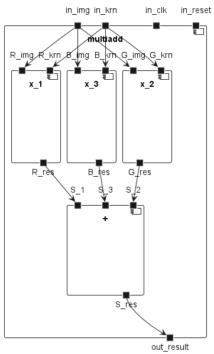
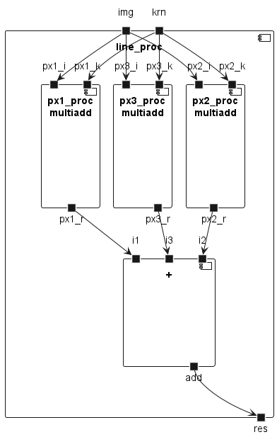
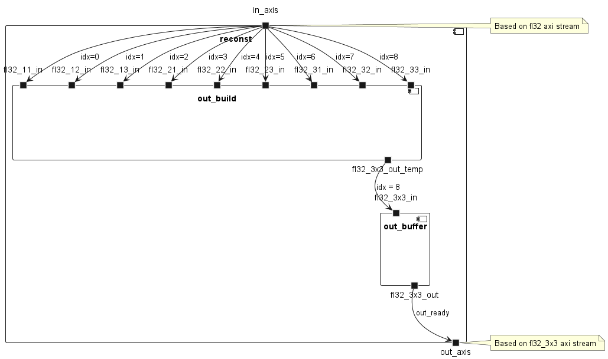
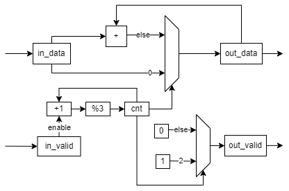
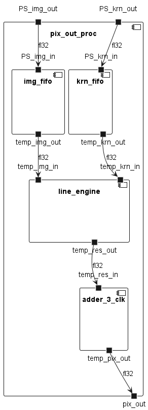
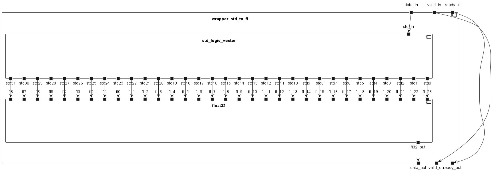
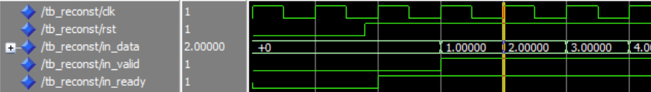
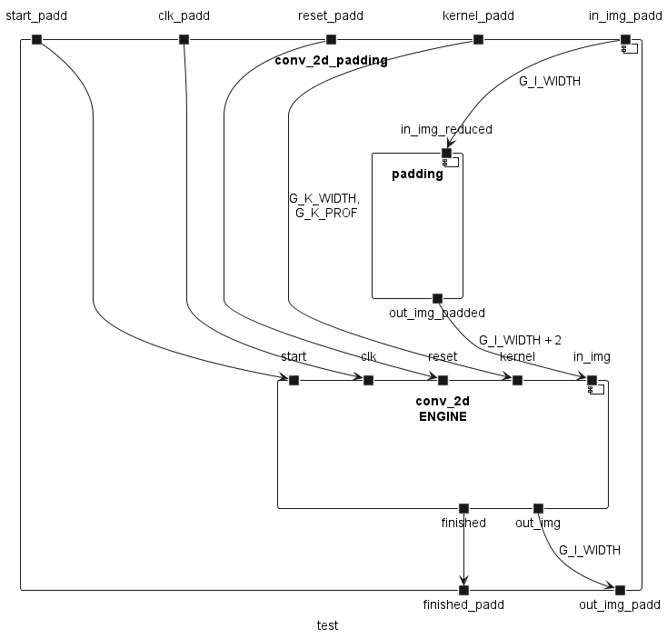
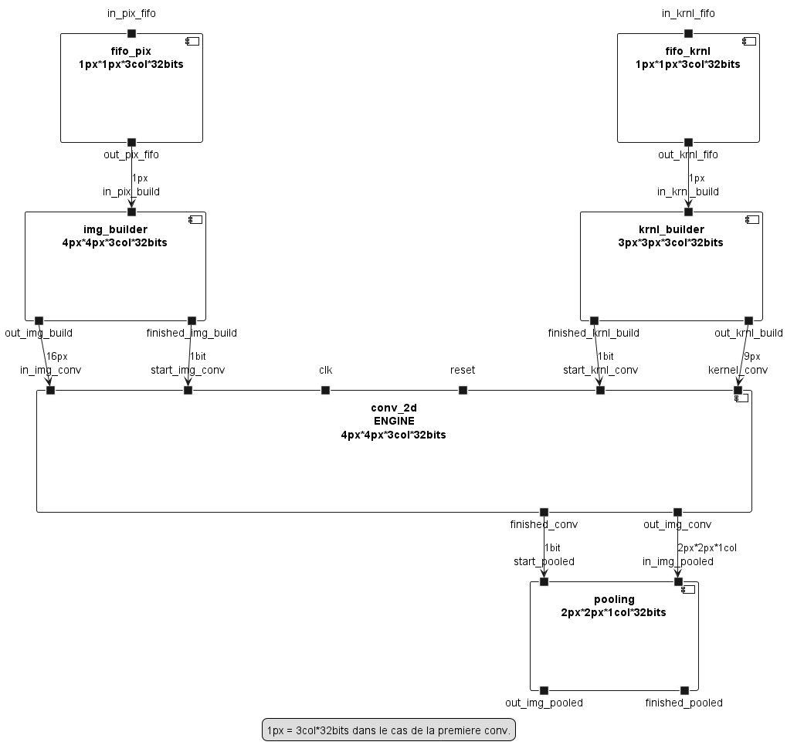

# FPGA part of project A-Eye
Developpers : Guilhem ROLLAND  
Versions : Vivado 2022.1, Vitis 2022.1  

## Introduction  
The idea is here to accelerate in hardware the longest operation. Currently, the convolution take about 60 percent of the processing time. That's why we start by accelerating the convolution steps.  

## Documentations v2 - Components  

### Multiadd  
#### Principle  
This block must process a multiplication between two float32, one corresponding to the image, and one to the kernel.  
This compute is parallelized in three block, one for each channel (in the first convolution, each channel correponds to one color).  
Once done, we add the three results of the multiplier and obtain the final result.  
  
#### Memory occupation  
Once synthesized on Vivado for the zybo z7 20, we can see that it will used 13% of LUTs and only 3% of DSPs.  

### Line_process  
#### Principle  
As shown above, we have spaces left and can parallelize 3 pixels processing engine (multiadd component). This is the goal of the line_process.  
Thus, the 3x3x3 convolution works with a line_process block which can process 3x3 float32. The process has to be repeated only 3 times so.  
  
#### Memory occupation  
Now, we used 44% of the LUTs.  We need one clock cycle to compute one line of 3 RGB pixels.  

### Rebuilding the arrays  
We have noticed that IO are limited on FPGA. That's why we choose to use axi stream protocol to receive and transmit datas. Thus, we use 32 IO to input float32 one by one (plus 2 IO for axi stream protocol), and we have to recompile the array inside the FPGA.  
  
We can now instantiate two of them, one for image and one for kernel.  

### Pixel output processing  
#### Principle  
Once we have the previous modules, able to compute 3 RGB pixels, we need to repeat three time the process to compute a 3x3 RGB pixels matrix, to output one monochrome pixel for one filter.  
#### Output system  
We have to get three floats, to add them, and output the result. This is done by this architecture :  
  
This is composed by an adder on the data, and a control system based on a counter, maximize by 2.  
#### Complete pixel output processing system  
The system looks like this :   
   

### Wrapper  
#### Introduction  
To implement the pixel output processing system in a vivado block design, we have to map the float in input and output to std_logic_vector. To do this, we first need to design wrapper, wrapper_fl_to_std for float32 to std_logic_vector(31 downto 0) and wrapper_std_to_fl for std_logic_vector(31 downto 0) to float32.  
#### std_logic_vector to float32  
In this wrapper, we map one bit of std_logic_vector(31 downto 0) to one bit of float32, also known as float(8 downto -23). We repeat this mapping for each bit. We want to keep valid and ready signal as they were, so just map it.    
  
#### float32 to std_logic_vector  
Here we do the reverse thing as above.   

## Communication protocol, based on AXI stream principle. 
To exchange data between two vhdl IP, we choose to use our own protocol.  
### Signals
It is based on three signals, when A want to send B some data :  
- *data* : from A to B : transport the data. In our system, this is mainly of type float32, or one of its subtypes.
- *valid* : from A to B : tell B that the data has to be taken on every cycle valid is high. This is based on std_logic.
- *ready* : from B to A : tell to A that B is ready to get data on the next cycle. 
### Example
- On reset, all signals are low.  
- When B is ready to get data, it sets *ready* to high for a number of clock cycles equals to the number of max data it can take.  
- **For each clock cycle**, if A see that *ready* is high, A pushes data on *data* and set *valid* to high.  
- B must save as much data as there are cycle times where *valid* is high.  

Comment : *data* can be set before *valid* is high. But it's only when *valid* is high that *data* has to be captured. 

  
## DMA architecture  
To improve data transfer, we choose to implement DMA. The system is described by the following diagram.  
  
  

## Documentations v1  
### What has been done
On the day of 22 June, we dispose of a convolution 2D engine, which is called with padding. Source code are in this git.  
  
### Proposal for 23 June
The proposal for the meetings of 23 June is to load picture and kernel with fifo and builder, process the convolution in order to produce a 2 by 2 matrix, and apply pooling on it.  
  
### Conclusion on v1
We have to design components one by one. Indeed, one component able to process one picture cannot be implemented on a FPGA. Thus, we switch to v2, and v1 is deserted.    

## Troubleshooting
Vivado simulator is uncompatible with float32, even if float32 are part of IEEE and support in VHDL2008. To simulate, I choose to use questa, which has a version free of charge (starter edition). To do this, you will have to generate a free license of Intel license webpage.  
To view all signals in questa sim, you have to disable optimisation when launching in command line : vsim -voptargs=+acc work.tb_XXXX.  
