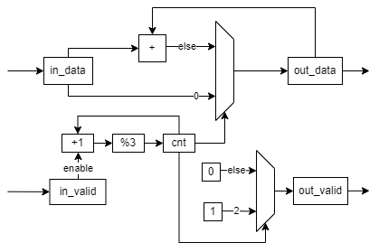
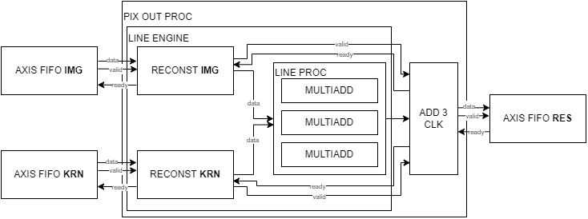

# FPGA part of project A-Eye
Developpers : Guilhem ROLLAND, Clement LEROY, Noemie ROLLAND  
Versions : Vivado 2022.1, Vitis 2022.1  

## Introduction  
The idea is here to accelerate in hardware the longest operation. Currently, the convolution take about 60 percent of the processing time. That's why we start by accelerating the convolution steps.  

In the software treatments, all data are float32. That's why the first objective was to use same type of data in the hardware. It appears that float32 is not synthetizable. It is possible to work with simple std_logic_vector and to reconstuct all the float32 arithmetic with functions but it is very complicated. That's why float32 won't be used in hardware.
It's easier to work with fixed point. This type is not synthetizable but the arithmetic is easy to reconstruct.  

In this part, it is admitted that the conversion is done in software. In reality, this conversion is not done. This is one of the next change in the software.

## Fixed point
Fixed point are used in this development. It is a bit vector are 32 bits in our case with uone sign bit, 8 interger bits and 23 fraction bits. The precision is 2^-23.
The following figure illustrates how a fixed point is formed :  

This is used in conv_v3 version.  

## Communication protocol : AXI4-Stream 
To exchange data between two vhdl IP, we choose to use the AXI4-Stream protocol.  
### Signals
It is based on three signals, when A want to send B some data :  
- *data* : from A to B : transport the data. The data is transmitted to B only when valid AND ready are high on a risingedge of the clock. Data is based on std_logic_vector.
- *valid* : from A to B : tell B that the data is valid and can be taken on the next clock cycle. This is based on std_logic.
- *ready* : from B to A : tell to A that B is ready to get data on the next clock cycle. This is based on std_logic.  
### Example
- On reset, all signals are low.  
- When B is ready to get data, it sets *ready* to high.
- **For each clock cycle**, if *valid* is high and A see that *ready* is high too, A pushes *data* on output (B input).  
- B must save as much data as there are cycle times where *valid* and *ready* are high.  

Comment : *data* can be set before *valid* is high. But it's only when *valid* is high that *data* has to be captured.  
*valid* has to stay high until *ready* goes high, if not, the valid data will not be transmitted to B.  

## Documentations v3-AXI4-S - Components  

### Multiadd  
#### Principle  
This block must process a multiplication between two fixed point (1 bit sign, 8 bits integer and 23 bits fraction), one corresponding to the image, and one to the kernel.  
The result of the multiplication of 2 fixed point of 32 bits is 64 bits. It's important to resize the result. That is why we get back only the result between bit 54 and bit 23.
This figure shows how the multiplication resize is done :

This compute is parallelized in three block, one for each channel (in the first convolution, each channel correponds to one color).  
Once done, we add the three results of the multiplier and obtain the final result.  
  
#### Memory occupation  
Once synthesized on Vivado for the zybo z7 20, we can see that it will used 0.13% of LUTs and only 1.6% of DSPs.  

### Line_process  
#### Principle  
As shown above, we have spaces left and can parallelize 3 pixels processing engine (multiadd component). This is the goal of the line_process.  
Thus, the 3x3x3 convolution works with a line_process block which can process 3x3 fixed point. The process has to be repeated only 3 times so.  
  
#### Memory occupation  
Now, we used 0.6% of the LUTs and 5% of DSPs.  We need one clock cycle to compute one line of 3 RGB pixels.  

### Rebuilding the arrays  
We have noticed that IO are limited on FPGA. That's why we choose to use axi stream protocol to receive and transmit datas. Thus, we use 32 IO to input fixed point one by one (plus 2 IO for axi stream protocol), and we have to recompile the array inside the FPGA.  
  
We can now instantiate two of them, one for image and one for kernel.  
Here is a chronogram to explain what happen :
  

### Pixel output processing  
#### Principle  
Once we have the previous modules, able to compute 3 RGB pixels, we need to repeat three time the process to compute a 3x3 RGB pixels matrix, to output one monochrome pixel for one filter.  
#### Output system  
We have to get three fixed point, to add them, and output the result. This is done by this architecture :  
  
This is composed by an adder on the data, and a control system based on a counter, maximize by 2.  
Here is a chronogram to explain what happen :
  

 
The complete convolution architecture is as follows :  
  
 

## DMA architecture  
To improve data transfer, we choose to implement DMA. The system is described by the following diagram.  
  
  
## Documentations v2  
### Conclusion on v2  
Float32 is not synthetizable and float32 arithmetic is hard to reconstruct. Thus, we switch to v3 instead of v2.

## Documentations v1  
### What has been done
On the day of 22 June, we dispose of a convolution 2D engine, which is called with padding. Source code are in this git.  
  
### Proposal for 23 June
The proposal for the meetings of 23 June is to load picture and kernel with fifo and builder, process the convolution in order to produce a 2 by 2 matrix, and apply pooling on it.  
  
### Conclusion on v1
We have to design components one by one. Indeed, one component able to process one picture cannot be implemented on a FPGA. Thus, we switch to v2, and v1 is deserted.    

## Troubleshooting
Vivado simulator is uncompatible with float32, even if float32 are part of IEEE and support in VHDL2008. To simulate, I choose to use questa, which has a version free of charge (starter edition). To do this, you will have to generate a free license of Intel license webpage.  
To view all signals in questa sim, you have to disable optimisation when launching in command line : vsim -voptargs=+acc work.tb_XXXX.  
